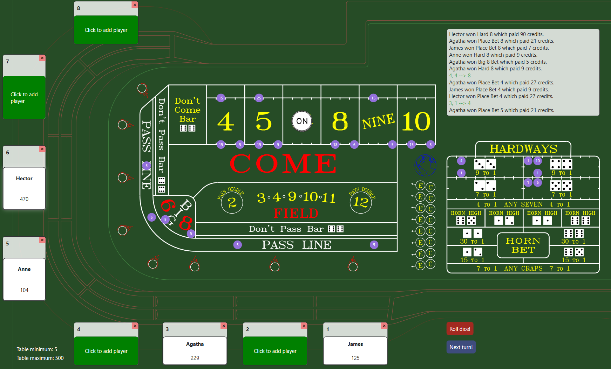

# Craps



Craps is a desktop WPF application using MVVM architecture written in C# targeting .NET 8. It simulates the casino dice game of the same name in which players bet on outcomes of rolls of a pair of dice. 

This craps simulator aims to faithfully recreate the full craps experience found in a Las Vegas casino. It does this by implementing:
 - the correct game-specific slang and terminology used when placing bets
 - multiple players per table (up to eight simultaneous players on one half of the table)
 - state machines to handle the states of all bets placed, including "working", "press and collect", "full and partial parlay", "lost"
 - rotation of the active dice roller ("shooter") as determined by the outcome of each roll
 - a faithful recreation of a real-world craps table layout rather than a simplified representation

A video explaining how the UI was created can be found [here]().

## Getting started

### Option 1 - Download and run the executable

The easiest way to try the simulator is to download the latest published version from the repository's **Releases** page.

1. Go to the [latest release](https://github.com/onepulltriple/craps/releases/latest).
2. Download the ZIP release containing the published application package.
3. Extract the downloaded archive.
4. Run the included executable.

No installation is required.

### Option 2 - Set up the project and run from Visual Studio

1. Install Visual Studio. [Download 2026](https://visualstudio.microsoft.com/downloads/)

   During installation, make sure the **.NET desktop development** workload is selected. This is required for the WPF application.

2. Clone the repository to your local machine using:

   ```bash
   git clone https://github.com/onepulltriple/craps
   ```

3. Open `Craps.sln` in Visual Studio.

4. Ensure that `CrapsTableWPF` is the startup project by right-clicking on the project name and selecting "Set as Startup Project".

5. Build and run the application in Visual Studio.